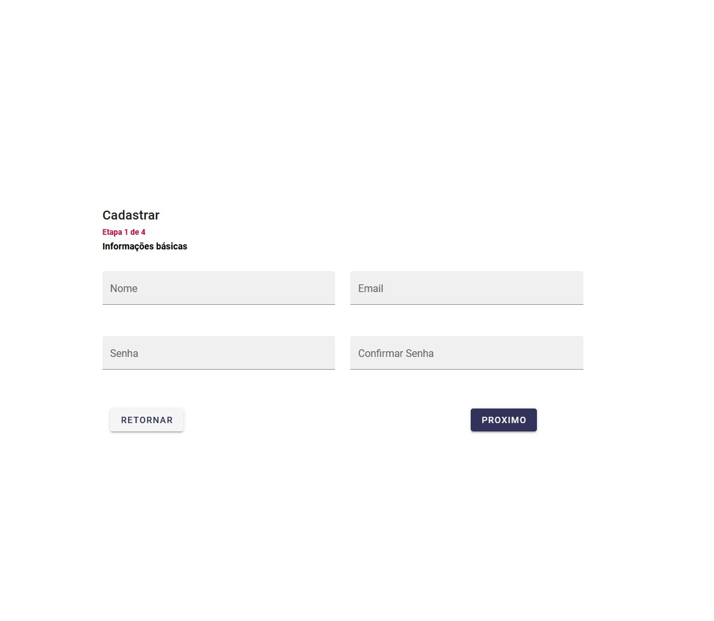
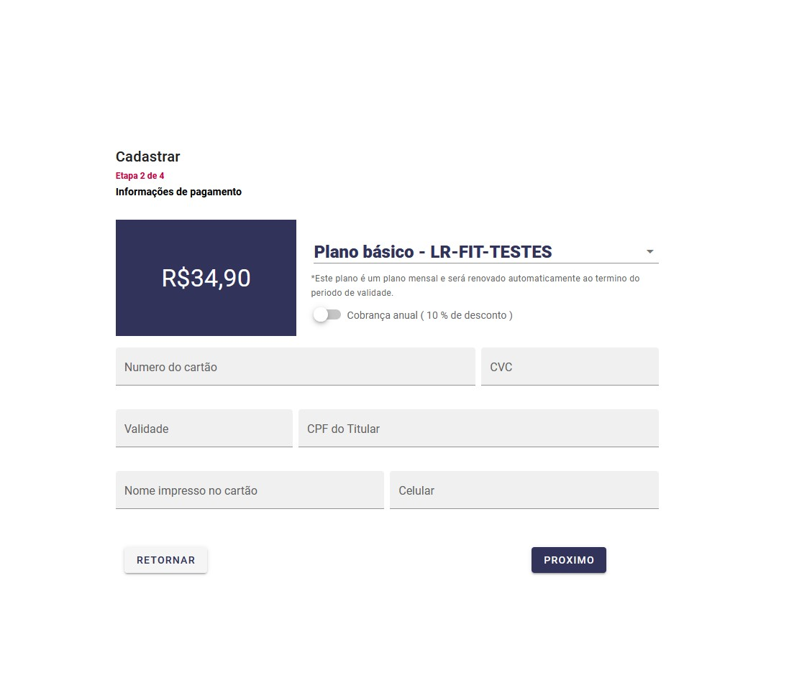
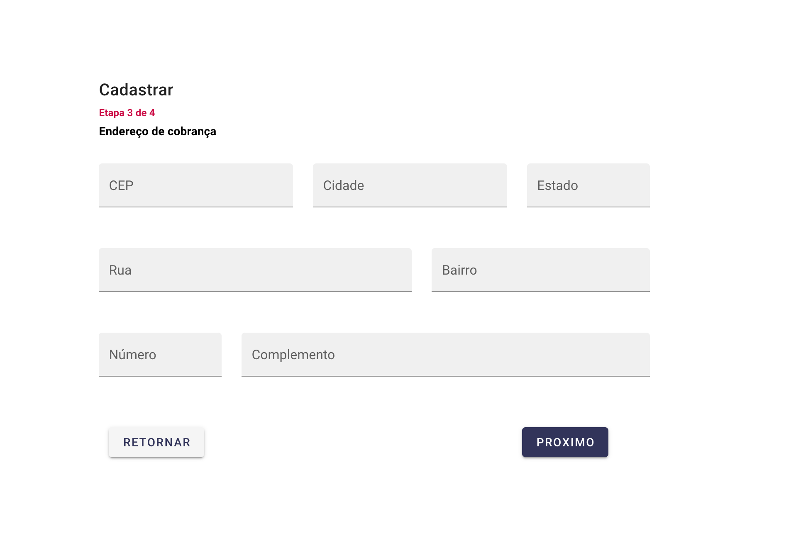
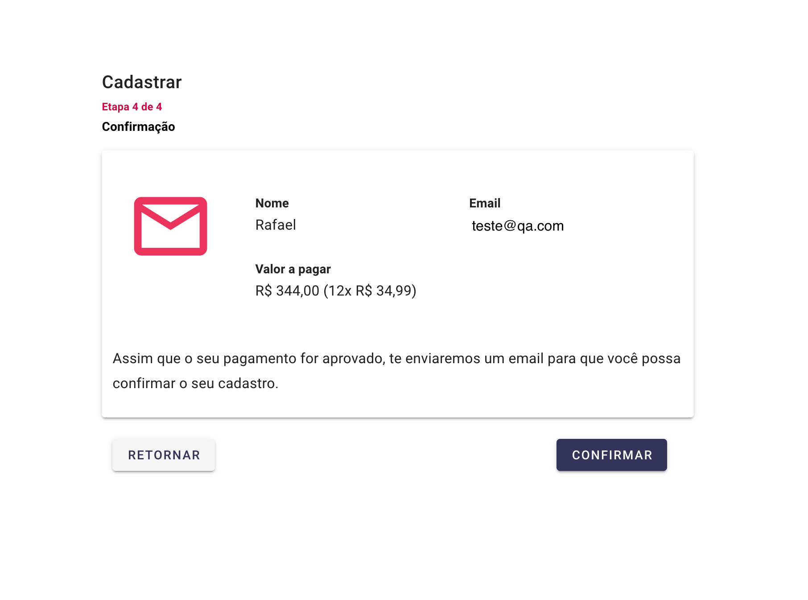

# Teste analista QA.

1 - Escolha um funcionalidade de qualquer app que conheça, e descreva o caso de uso detalhado da mesma.

2 - Um novo form foi aplicado(segue a imagem), como você testaria cada elemento?

3 - Liste ferramentas que utilize para avaliar e testar uma funcionalidade.

# Envio do teste

Ao finalizar, deverá ser enviado um email para rafael@rogalabs.com com o teste finalizado. O candido que deverá avaliar a melhor forma para realizar o teste. 

# Avaliação

Irá ser avaliado: 
- Seu conhecimento técnico e criatividade;
- Sua habilidade para testar nos mínimos detalhes uma funcionalidade. 

# Dúvidas

Caso tenha alguma dúvida, poderá enviar um email para rafael@rogalabs.com.
